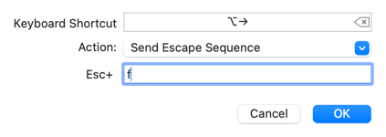

# Mac setup

## Cấu hình backwards và forwards trên iterm2

1. Preferences > Keys (or Preferences > Profiles > Keys)
2. Click vào dấu cộng sau đó làm như ảnh


Di chuyển sang bên phải một từ
```
option+right
send escape sequence
f
```

Di chuyển sang bên trái một từ
```
option+left
send escape sequence
b
```

Xóa một từ
```
option+delete 
send hex code
0x1B 0x08
```

> Lưu ý nút opction có thể tùy ý thay đổi để phù hợp với bản thân
> 

## Các phần mềm thông dụng

### Tạo boot window

[WinDiskWriter](https://github.com/TechUnRestricted/WinDiskWriter)

### Ứng dụng mở rộng tính năng spotlight

[raycast](https://www.raycast.com/)